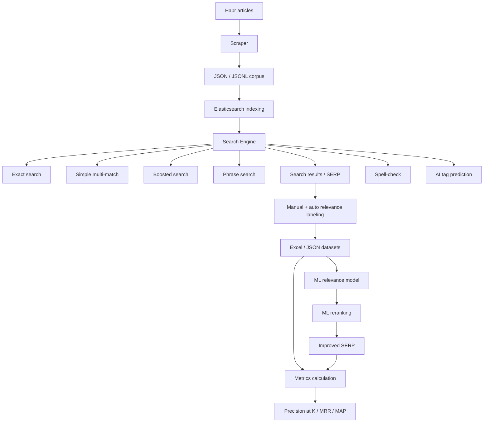

# Habr Smart Search Engine

<div align="center">


**Поисковый движок по статьям Habr: от парсинга и индексации до ML-реранжирования, авторазметки и оценки качества поиска.**

[Архитектура](#архитектура) · [Быстрый старт](#быстрый-старт) · [Результаты](#результаты) · [Датасеты и разметка](#датасеты-и-разметка)

</div>

---

## О проекте

**Habr Search Engine** — учебный, но инженерно полноценный проект поисковой системы по статьям Habr.

Идея была не в том, чтобы «просто подключить Elasticsearch», а в том, чтобы пройти полный цикл разработки поискового продукта:

```text
сбор данных → очистка → индексирование → поиск → разметка выдачи → метрики → ML-улучшения → сравнение результатов
```

Проект выполнялся в рамках **СГУ, КНиИТ**, но я сознательно строил его не как формальную лабораторную, а как небольшой R&D-полигон: с экспериментами, оценкой качества, ручной и автоматической разметкой, ML-реранжированием и отдельными попытками улучшить выдачу с помощью NLP.

Это не production-поисковик, а инженерный прототип, где собран полный цикл: сбор данных → индекс → поиск → оценка → ML-улучшения.

---

## Зачем это нужно

Обычный поиск часто отвечает на вопрос: «где встречаются слова из запроса?»

Но хороший поиск должен отвечать на другой вопрос: **«что действительно полезно пользователю?»**

В этом проекте я хотел потрогать руками именно эту разницу:

* как собрать корпус документов;
* как построить индекс в Elasticsearch;
* как влияют разные поисковые стратегии;
* как оценивать качество выдачи не на глаз, а через метрики;
* как использовать разметку для обучения модели релевантности;
* как добавить ML-реранжирование поверх классического поиска;
* как автоматически получать разметку через LLM API и сохранять ее в табличном виде для дальнейшего анализа.

---

## Что умеет проект

### Сбор данных

* парсинг статей Habr по ID;
* извлечение заголовка, автора, даты, хабов, тегов и текста статьи;
* сохранение корпуса в `json` / `jsonl`;
* базовая устойчивость к отсутствующим страницам и невалидным ответам.

### Elasticsearch-поиск

* индексирование статей в Elasticsearch;
* поиск по нескольким полям: `title`, `text`, `hubs`, `tags`, `author`;
* бустинг важных полей;
* несколько режимов поиска:

  * точный поиск;
  * простой multi-match поиск;
  * экспериментальный boost-поиск;
  * поиск точных фраз в кавычках;
* подсветка найденных фрагментов.

### Spell-check

* проверка опечаток через Yandex Speller API;
* поддержка русского и английского текста;
* интерактивное предложение исправления запроса;
* отключение spell-check для точных фраз, чтобы не ломать намерение пользователя.

### ML-реранжирование

* отдельный ML-ранкер поверх результатов Elasticsearch;
* обучение модели релевантности на размеченной SERP-выдаче;
* сравнение выдачи до и после ML;
* сохранение метрик в Excel;
* возможность включать и выключать ML-реранжирование в интерактивном режиме.

### Авторазметка и LLM

В проекте также была сделана разметка релевантности через API DeepSeek и собственная авторазметка.

Идея пайплайна:

```text
запрос + документ из выдачи → LLM/правила → оценка релевантности → Excel/JSON → обучение/оценка
```

Это помогло быстрее собрать обучающий датасет для экспериментов с ранжированием. Часть данных лежит в репозитории, часть при необходимости будет продублирована через Google Drive.

### AI-теги

* предсказание тегов по содержанию статьи;
* эксперименты с TF-IDF + Logistic Regression;
* эксперименты с ruBERT-подходом;
* вывод предсказанных тегов вместе с поисковой выдачей.

### Метрики качества

Для оценки поиска использовались классические IR-метрики:

* `Precision@5`;
* `Precision@10`;
* `MRR`;
* `MAP`;
* сравнение качества до и после ML-реранжирования.

> Скриншоты и итоговые значения метрик будут добавлены в раздел [Результаты](#результаты).

---

## Стек

| Область          | Технологии                                 |
| ---------------- | ------------------------------------------ |
| Язык             | Python                                     |
| Поиск            | Elasticsearch                              |
| Парсинг          | requests, BeautifulSoup                    |
| Работа с данными | pandas, numpy, openpyxl, json/jsonl        |
| ML               | scikit-learn, joblib                       |
| NLP/эксперименты | TF-IDF, Logistic Regression, ruBERT-подход |
| Spell-check      | Yandex Speller API                         |
| LLM-разметка     | DeepSeek API                               |
| Оценка качества  | Precision@K, MRR, MAP                      |

---

## Архитектура



---

## Структура репозитория

```text
.
├── habr_scraper.py                         # Сбор статей Habr по ID
├── habr_articles_by_id.json                # Сохраненный корпус статей
├── habr_articles_by_id.jsonl               # Корпус в JSONL-формате
├── requirements_ml.txt                     # Зависимости для ML-части
│
└── elastic_search/
    ├── setup_elasticsearch.py              # Создание индекса и загрузка данных
    ├── habr_search.py                      # Основной интерактивный поисковик
    ├── ml_ranker.py                        # ML-реранжирование выдачи
    ├── calculate_metrics.py                # Подсчет метрик качества поиска
    ├── collect_serp_data.py                # Сбор выдачи для разметки
    ├── check_index.py                      # Проверка индекса
    ├── habr_serp_data.xlsx                 # Размеченная/собранная SERP-выдача
    ├── search_metrics.xlsx                 # Метрики базового поиска
    ├── search_metrics_after_ml.xlsx        # Метрики после ML-реранжирования
    ├── search_metrics_old.xlsx             # Старые результаты экспериментов
    ├── serp_data.json                      # SERP-данные в JSON
    ├── serp_data_converted_from_json.xlsx  # Конвертация SERP-данных в Excel
    │
    └── ml/
        ├── collect_serp_data_for_ml.py     # Подготовка данных для ML
        ├── llm-relevant.py                 # LLM-разметка релевантности
        ├── llm-test.py                     # Эксперименты с LLM
        ├── logic_regression.py             # Обучение модели релевантности
        ├── tag_predictor.py                # Предсказание тегов
        ├── test_tag_predictor.py           # Проверка tag predictor
        ├── all_serp_data_for_ml.json       # Данные для ML
        ├── all_serp_data_for_ml.xlsx       # Excel-датасет для ML
        ├── relevance_classifier.pkl        # Обученная модель
        └── relevance_classifier_with_query.pkl
```

---

## Быстрый старт

### 1. Клонировать репозиторий

```bash
git clone https://github.com/Optoed/habr-scrap-and-search.git
cd habr-scrap-and-search
```

### 2. Создать виртуальное окружение

```bash
python -m venv .venv
source .venv/bin/activate      # Linux / macOS
# .venv\Scripts\activate       # Windows
```

### 3. Установить зависимости

```bash
pip install -r requirements_ml.txt
```

Если запускается парсер, также могут понадобиться зависимости для HTML-парсинга:

```bash
pip install beautifulsoup4 lxml requests
```

### 4. Запустить Elasticsearch

Локально Elasticsearch должен быть доступен по адресу:

```text
http://localhost:9200
```

### 5. Собрать статьи

```bash
python habr_scraper.py
```

Скрипт собирает статьи Habr и сохраняет их в JSONL-формате.

### 6. Создать индекс и загрузить данные

```bash
cd elastic_search
python setup_elasticsearch.py
```

### 7. Запустить поиск

```bash
python habr_search.py
```

Доступные режимы внутри интерактивного поиска:

```text
/exact   — точный поиск
/simple  — простой поиск
/boost   — поиск с бустингом полей
/ml_on   — включить ML-реранжирование
/ml_off  — выключить ML-реранжирование
/tags_on — включить AI-теги
/tags_off — выключить AI-теги
/exit    — выход
```

Примеры запросов:

```text
/simple машинное обучение python
/boost база данных
/exact elasticsearch индексирование
"точная фраза в кавычках"
```

---

## Результаты

В проекте были реализованы и проверены:

* корпус статей Habr;
* Elasticsearch-индекс;
* несколько поисковых стратегий;
* spell-check запросов;
* сбор и разметка поисковой выдачи;
* авторазметка через DeepSeek API;
* ML-модель релевантности;
* реранжирование результатов поиска;
* расчет метрик до и после ML;
* предсказание AI-тегов для статей.

### Метрики поиска после ML-реранжирования

После ML-реранжирования были получены следующие значения качества выдачи:

| Эксперимент                  | Precision@5 | Precision@10 |     MRR |     MAP |
| ---------------------------- | ----------: | -----------: | ------: | ------: |
| Elasticsearch + ML reranking |     `0.860` |      `0.830` | `0.950` | `0.901` |

Интерпретация результатов:

* **Precision@5 = 0.860** — в среднем 4.3 из 5 верхних результатов были релевантными;
* **Precision@10 = 0.830** — в среднем 8.3 из 10 результатов были релевантными;
* **MRR = 0.950** — первый релевантный результат в среднем находился примерно на позиции 1.1;
* **MAP = 0.901** — высокое общее качество ранжирования по набору тестовых запросов.

### Детальный анализ по запросам

Оценка проводилась на наборе из 10 тестовых запросов:

| Запрос                   |   P@5 |  P@10 |   MRR | Релевантных |
| ------------------------ | ----: | ----: | ----: | ----------: |
| python машинное обучение | 0.600 | 0.500 | 1.000 |        5/10 |
| docker контейнеризация   | 0.800 | 0.900 | 0.500 |        9/10 |
| нейросети искусственный  | 1.000 | 1.000 | 1.000 |       10/10 |
| веб разработка frontend  | 0.800 | 0.700 | 1.000 |        7/10 |
| база данных SQL          | 0.800 | 0.800 | 1.000 |        8/10 |
| пайтон программирование  | 1.000 | 1.000 | 1.000 |       10/10 |
| javascript фреймворки    | 1.000 | 1.000 | 1.000 |       10/10 |
| golang новичку           | 0.800 | 0.700 | 1.000 |        7/10 |
| мобильные приложения     | 0.800 | 0.900 | 1.000 |        9/10 |
| разработка игр unity     | 1.000 | 0.800 | 1.000 |        8/10 |

### Модель классификации релевантности

Также была обучена модель классификации релевантности. На размеченном датасете из **1308** примеров она показала accuracy **0.729**.

| Класс            | Precision | Recall | F1-score | Support |
| ---------------- | --------: | -----: | -------: | ------: |
| 0 — нерелевантно |      0.84 |   0.71 |     0.77 |     823 |
| 1 — релевантно   |      0.61 |   0.77 |     0.68 |     485 |
| Macro avg        |      0.72 |   0.74 |     0.72 |    1308 |
| Weighted avg     |      0.75 |   0.73 |     0.73 |    1308 |

### AI-теги

Отдельно проверялась генерация AI-тегов для найденных статей. Например, для статьи про псевдослучайный `random` в Python модель выделяла теги вроде `python`, `random`, `программирование` и показывала их вместе со score рядом с результатом поиска.

Для эксперимента с ruBERT-подходом по предсказанию AI-тегов на тестовой выборке были получены следующие значения:

| Метрика          | Значение |
| ---------------- | -------: |
| `eval_loss`      | `0.1050` |
| `eval_precision` | `0.9641` |
| `eval_recall`    | `0.5132` |
| `eval_f1`        | `0.6699` |
| `epoch`          | `5.0000` |

Здесь хорошо видно характерное поведение модели: высокая precision означает, что когда модель уверенно ставит тег, она часто попадает правильно; более низкий recall показывает, что часть подходящих тегов она пропускает. Для этого этапа проекта это полезный результат: модель осторожная, зато не засыпает выдачу случайными тегами.

### Что важно

Главный результат проекта — не одна конкретная цифра, а собранный цикл улучшения поиска:

```text
гипотеза → поисковая стратегия → выдача → разметка → метрики → ML → повторная оценка
```

Именно такой цикл используется в реальных поисковых и рекомендательных системах, только на большем масштабе и с более строгой инфраструктурой.

## Датасеты и разметка

В репозитории есть несколько файлов с данными и результатами экспериментов:

* `habr_articles_by_id.json`;
* `habr_articles_by_id.jsonl`;
* `elastic_search/habr_serp_data.xlsx`;
* `elastic_search/search_metrics.xlsx`;
* `elastic_search/search_metrics_after_ml.xlsx`;
* `elastic_search/ml/all_serp_data_for_ml.xlsx`.

Если Excel-файлы будут слишком тяжелыми для GitHub или потребуется отдельная версия датасета, можно добавить зеркало на Google Drive в отдельный блок `Dataset mirror`.

---

## Чему я научился

В этом проекте я получил практический опыт в нескольких слоях поисковой системы:

* сбор и подготовка текстовых данных;
* проектирование индекса Elasticsearch;
* настройка поисковых запросов и бустинга;
* работа с полнотекстовым поиском;
* сбор SERP-датасета;
* ручная и автоматическая разметка релевантности;
* использование LLM API для ускорения разметки;
* обучение простой ML-модели поверх поисковой выдачи;
* расчет IR-метрик;
* анализ качества поиска до и после ML-улучшений.

---

## Ограничения

У проекта есть честные ограничения:

* нет production-инфраструктуры;
* нет полноценного web-интерфейса;
* качество авторазметки зависит от промптов и модели;
* корпус ограничен собранными статьями;
* ML-реранжирование обучалось на ограниченном датасете;
* нет A/B-тестов и пользовательской поведенческой аналитики.

Эти ограничения не маскируются — они показывают, что еще нужно доработать для перехода от исследовательского прототипа к более зрелой системе.

---

## Что можно улучшить дальше

* добавить FastAPI backend для поиска;
* сделать простой web-интерфейс;
* добавить Docker Compose для Elasticsearch и приложения;
* улучшить пайплайн разметки;
* сравнить BM25, semantic search и hybrid search;
* добавить sentence-transformers / dense embeddings;
* подключить FAISS или векторный поиск Elasticsearch;
* сделать нормальный train/test split для оценки ранжирования;
* добавить CI-проверки и воспроизводимые эксперименты;
* вынести конфиги в `.env`.

---

## Менторство

Проект выполнялся в контексте **СГУ, КНиИТ**.

Менторскую поддержку оказывал преподаватель СГУ и специалист в области ML и разработки - Филлипов Борис Александрович.

---

## Лицензия

Проект распространяется под лицензией MIT.
